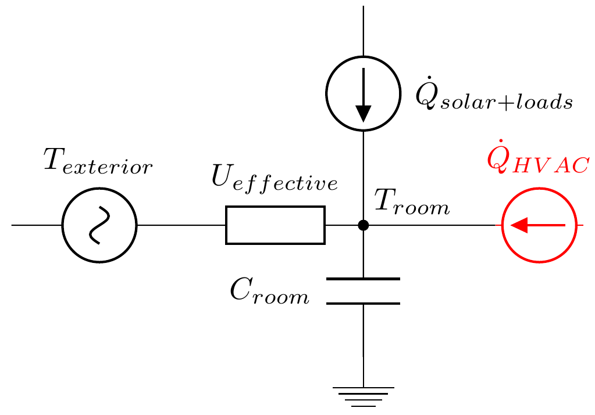
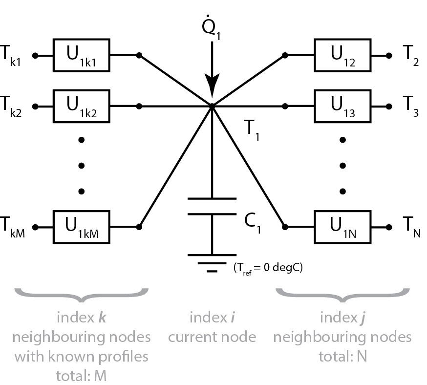

Model-Based Predictive Control Overview
=======================================
Model-based predictive controls is an optimization-based control framework
where control actions are optimized over a prediction horizon to minimize a cost function given constraints. It relies on a model describing the system dynamics in combination of constraints limiting the actions to allowable or desired ranges. Future estimates of exogenous inputs and disturbances are included, eg. weather forecast, occupants' behaviours.

The MPC framework makes the operating intent *explicit*: the cost is what needs to be minimized, the constraints are the limits of the system and the variables are what can be controlled. In the conventional scheduled operation, the control desires are *implicit* in how the sequences are programmed and can be cumbersome to comprehend especially if they contain many heuristics. The owner can only hope occupants will remain comfortable during a demand response event; whereas using MPC, the cost function would force to reduce demand during a demand response event but the constraints would guarantee comfort. What is interesting from the outcomes of MPC is, that in some cases, well-known heuristic rules are discovered by the algorithm: demand limiting, economizer cycles, temperature reset and pre-conditioning of spaces and so on.

The objective here is not to teach you optimization or even what is model-based predictive controls. There are just too many excellent references out there, I would not want to embarrass myself by producing low grade explanations.

You can start by reading [this webpage](http://www.me.berkeley.edu/~yzhwang/MPC/optimization.html) made by grad students from Berkeley's [MPC lab](http://www.mpc.berkeley.edu), [this document](http://kom.aau.dk/~mju/downloads/otherDocuments/MPCusingCVX.pdf) demonstrates a simple application that uses [CVX](http://cvxr.com/cvx/) which is in part developed by Prof. Stephen Boyd from Stanford. He also has [his lectures on convex optimization](https://lagunita.stanford.edu/courses/Engineering/CVX101/Winter2014/about) posted online -- free -- along with his co-authored [book](http://www.stanford.edu/~boyd/cvxbook/), which is excellent -- also free. You can also take a look at [this article](http://www.sciencedirect.com/science/article/pii/S0378778811004105) from the OptiControl team of Switzerland.

What is demo-ed in this notebook is not the "state of the art", it, however, provides an easy way to try a few ideas. If your objective is speed, I suggest you look into using compiled solvers tailored to the problem, *e.g.* [CVXGEN](http://cvxgen.com/docs/index.html), for non-commercial use. There are also other commercial solvers like GUROBI and CPLEX among many.

Finally, there's also a very interesting approach on linking model calibration with controls by relying on auto-differentiation libraries such as [jax](https://github.com/google/jax) or a lot of the tools from [Julia's SciML library](https://sciml.ai). In these cases, we would set up a model, train the parameters by using gradient descent on the gradient of the model parameters given the fit loss function, once the model is fit, we would swap the train loss function with the controls loss function and take the gradient instead relative to the controllable inputs. Definitely approaches worth exploring!

I will start by showing what an optimization looks like since too many throw around that word not knowing what they're talking about. Running 10'000 simulations with different parameters and returning the best is **not** an optimization; it's more of a design exploration. In that sense, genetic algorithms cannot guarantee an *optimal* result more so than a very good design. Genetic algorithms are explorative algorithms, whereas optimization is exploitative. A hybrid is possible -- see memetic evolutionary algorithms.

General optimization formulation
--------------------------------
$\textrm{minimize}~f(x)$

$\textrm{subject~to}~h_i(x) = 0,~i \in 1, \dots , m$

$g_j(x) \geq 0,~j \in 1, \dots ,n$

The function $f(x)$ will be minimized while the equality constraints of $h_i(x)$ and inequality constraints of $g_j(x)$ must be satisfied. The function $f(x)$ is referred to as the cost function. The constraints can also be included in the cost function as soft constraints. As soft constraints, they may be violated, but at a high cost; whereas as hard constraints, if a given solution violates the constraints, it is completely rejected.

The solution $x^*$ is called the optimal solution *iff* $f(x^*) \leq f(x)~\forall~x$. (If the equality holds, then more than one optimal exists and $x^*$ is referred to as a soft minimum; otherwise, if there is only one optimal, then it is a hard minimum.)

Optimization formulation for MPC
--------------------------------
Specifically, the design of an MPC algorithm requires a discrete time predictive model of the system to be controlled, weights or coefficients of the cost function of the optimization problem, and constraints. When applying the optimal control sequence to the real system the resulting evolution must be as close as possible to the time-series prediction. In such a dynamic optimization problem, the objective or cost function, $J$, is minimized over a prediction horizon, $N-1$, see the Figure below for more detail including mathematical descriptions of common types of cost functions and constraints for a discrete-time MPC framework. Applied to buildings, the cost function can be the actual operating cost based on electrical rates, which can be variable to include demand response signals and can have a reward for promoting self-consumption of renewable energy. They can aid the utility by relying on energy flexibility concepts such as optimally controlling their thermal and/or electrical storage systems. The constraints, which can be formulated both on system input and output, typically include temperature range restrictions for occupant comfort or safety reasons, equipment capacity limitations, cycling limitations and as required. The process to be controlled is modelled as a linear time-invariant discrete time system. Specifically, the state of the system for an incremental time step is returned by the model, $f(x_k,u_k,w_k)$, of the system where $x_k$ are system variables which track the system dynamics, $u_k$ are the control inputs or variables that can be manipulated to improve the building performance, and $w_k$ are the time series of exogenous inputs that can be observed but not controlled, eg. weather. The system constraints can be softened into penalties on the objective function where violations result in a worsened objective value instead of an infeasible solution. In general, the objective function and constraints should be convex, eg. quadratic costs and linear costs, in order to use highly efficient solvers. In cases of non-convex problems, iterative methods can be used considering a convex problem for the given iterative optimization step. To consider time-varying components, such as operable windows a set of time-invariant parameters can be trained and these parameters selected based on the state of the windows.

](Figures/oldewurtel_2012_MPC_eqs.jpg)

State-Space Representation
==========================
We would want to represent the MPC problem in a simple way, so how are things done in the controls literature? One popular approach is using a state-space representation, also see [the Wiki page for it](https://en.wikipedia.org/wiki/State-space_representation)! The most general state-space representation of a linear system with $p$ inputs, $q$ outputs and $n$ state variables is written in the following form:

${\displaystyle {\dot {\mathbf {x} }}(t)=\mathbf {A} (t)\mathbf {x} (t)+\mathbf {B} (t)\mathbf {u} (t)}$

${\displaystyle \mathbf {y} (t)=\mathbf {C} (t)\mathbf {x} (t)+\mathbf {D} (t)\mathbf {u} (t)}$

where:

$\mathbf {x} (\cdot )$ is called the "state vector",  $\mathbf {x} (t)\in \mathbb {R} ^{n}$;

$\mathbf {y} (\cdot )$ is called the "output vector",  $\mathbf {y} (t)\in \mathbb {R} ^{q}$;

$\mathbf {u} (\cdot )$ is called the "input (or control) vector", $\mathbf {u} (t)\in \mathbb {R} ^{p}$;

${\displaystyle \mathbf {A} (\cdot )}$ is the "state (or system) matrix", ${\displaystyle \operatorname {dim} [\mathbf {A} (\cdot )]=n\times n}$,

${\displaystyle \mathbf {B} (\cdot )}$ is the "input matrix", ${\displaystyle \operatorname {dim} [\mathbf {B} (\cdot )]=n\times p}$,

${\displaystyle \mathbf {C} (\cdot )}$ is the "output matrix",  ${\displaystyle \operatorname {dim} [\mathbf {C} (\cdot )]=q\times n}$,

${\displaystyle \mathbf {D} (\cdot )}$ is the "feedthrough (or feedforward) matrix" (in cases where the system model does not have a direct feedthrough, ${\displaystyle \mathbf {D} (\cdot )}$ is the zero matrix),  ${\displaystyle \operatorname {dim} [\mathbf {D} (\cdot )]=q\times p}$,

${\dot {\mathbf {x} }}(t):={\frac {\operatorname {d} }{\operatorname {d} t}}\mathbf {x} (t)$.

Which can be simplified for an explicit discrete time-invariant system as:

${\displaystyle \mathbf {x} (t+1)=\mathbf {A} \mathbf {x} (t)+\mathbf {B} \mathbf {u} (t)}$

${\displaystyle \mathbf {y} (t)=\mathbf {C} \mathbf {x} (t)+\mathbf {D} \mathbf {u} (t)}$

But we make another simplifying assumption: the temperature of the space is directly measured and represents the state of the system -- so called "ground truth dynamics". In other words, matrix $\mathbf{C}$ is the identity matrix and $\mathbf{D}$ is all zeros. We also like to put all external factors, called exogenous inputs, in another variable $\mathbf{w}(t)$. And, for the sake of convenience, we simply *reassign* the variable $\mathbf{C}$ to represent the "matrix" mapping the effects of the exogenous inputs onto the change of the state:

${\displaystyle \mathbf {x} (t+1)=\mathbf {A} \mathbf {x} (t)+\mathbf {B} \mathbf {u} (t)} +\mathbf {C} \mathbf {w} (t) + \epsilon$

And for the sake of completeness, I added the $\epsilon$ error term to represent all residual effects not captured by this simple linear model. We can model those some other way ;) Basically, when the residual $\epsilon$ starts looking like noise, then the model has captured all the information in the data, see [the Augmented Dickey-Fuller test](https://en.wikipedia.org/wiki/Augmented_Dickey–Fuller_test).

The goal is to model the building physics and represent it in a state-space representation which make things quite convenient. There are other neat things in the representation, but I'll invite you to read the [state-space representation wiki page](https://en.wikipedia.org/wiki/State-space_representation).

Grey-Box Model: the Resistor-Capacitor Thermal Circuit
======================================================
Straight to it. Here's a representation of a small space or room as a thermal circuit.

<!--  -->

In the thermal analogy, a voltage is temperature and current is heat flux. The exterior temperature node, $T_{exterior}$, is defined as a voltage source and connects to the room temperature node, $T_{room}$, via a thermal conductor $U_{effective}$. A conductor is the reciprocal of a resistor: $U = {1}/{R}$. The space or room has a thermal capacitance $C_{room}$ which represents all the stuff that's in it that can store heat. When we wish to characterize a space to know how it decay towards the ambient temperature, we can calculate its thermal decay constant $\tau = 1/RC = U/C$. It represents the time the space decays to 63.2% of a final asymptotic value, also [see the time constant wiki page](https://en.wikipedia.org/wiki/Time_constant). A system with a larger time constant would benefit more having predictive controls than a lighter and faster-acting system.

The HVAC system, $\dot{Q}_{\textrm{HVAC}}$, is the only variable we can control. We could use On-Off controls, Proportional control, PI, PID, or use a schedule, but they don't explicitly consider thermal mass. In this illustration, the HVAC represents both heating and cooling -- cooling would have a negative heat input. The solar and other loads, $\dot{Q}_{\textrm{solar+loads}}$, are put together since these are input we cannot control but can, sometimes, measure. The heat balance at the node is given in the explicit scheme:

$\displaystyle\frac{C_{\textrm{room}}}{\Delta t} (T(t+1) - T(t)) =
U_\textrm{effective} (T_{\textrm{exterior}}(t) - T(t)) +
\dot{Q}_\textrm{HVAC}(t) +
\dot{Q}_\textrm{solar+loads}(t)$

And so the temperature at the next timestep can be determined:

$T(t+1) = T(t) +
\displaystyle\frac{\Delta t}{C_{\textrm{room}}} \left[ U_\textrm{effective} (T_{\textrm{exterior}}(t) - T(t)) +
\dot{Q}_\textrm{HVAC}(t) +
\dot{Q}_\textrm{solar+loads}(t) \right]$

Of course, this is a *simplified* representation of a space. We are attempting to represent the thermal behaviour of a zone or room with only 2 variables! We are also exploring on adding in a neural network (could also be a Gaussian process model) to cover the residual effects not captured by this model.

A Note about Units
------------------
Although in SI units (don't get me started on Freedom units!) the correct unit for energy is Joules, temperature in Kelvin, time in seconds, power in Watts (J/s); we would prefer to instead use kWh for energy, $^\circ$C for temperature, hours for time and kW for power. Why? So that the parameters $U, C, Q$ and other coefficients be in a near enough magnitude for numerical reasons.

For a relatively small building, you can expect to have a thermal capacitance in the order of $10^9$ to $10^{12}$ Joules; whereas in kWh, you can divide this by $3.6 \times 10^6$. Conductance could be around $10^3$ W/K, so in kW/K it would be in the $10^0$. We can normalize and standardize parameters in deep learning without much attention, but here, since there's a physical significance, it has to have a reason.

Detailing the [A, B, C] Matrices
================================
The idea here is to get:

$T(t+1) = T(t) +
\displaystyle\frac{\Delta t}{C_{\textrm{room}}} \left[ U_\textrm{effective} (T_{\textrm{exterior}}(t) - T(t)) +
\dot{Q}_\textrm{HVAC}(t) +
\dot{Q}_\textrm{solar+loads}(t) \right]$

to look like:

${\displaystyle \mathbf {x} (t+1)=\mathbf {A} \mathbf {x} (t)+\mathbf {B} \mathbf {u} (t)} +\mathbf {C} \mathbf {w} (t)$

What to start thinking about is to realize the meaning of $\mathbf{x, u, w}$ variables: these are the states, controls and exogenous inputs. What is the state of a space? Ans: it's temperature. Controls? The HVAC. And exogenous inputs? Exterior temperature, solar radiation, internal gains, or other sources that can be measured. We need to take the heat balance equation and tease away these variables:

$T(t+1) =
\left[1 - \displaystyle\frac{\Delta t~U_\textrm{effective}}{C_{\textrm{room}}} \right] \{ T(t) \} +
\left[\displaystyle\frac{\Delta t}{C_{\textrm{room}}} \right]
\{ \dot{Q}_\textrm{HVAC}(t) \} +
\left[ \displaystyle \frac{\Delta t~U_\textrm{effective}}{C_{\textrm{room}}},~\displaystyle \frac{\Delta t}{C_{\textrm{room}}} \right]
\begin{Bmatrix}
    T_{\textrm{exterior}}(t) \\
    \dot{Q}_\textrm{solar+loads}(t)
\end{Bmatrix}$

Do you see the pattern? Just to make it clear:

$\mathbf {x} (\cdot ) \colon \{T\}$

$\mathbf {u} (\cdot ) \colon \{\dot{Q}_\textrm{HVAC}\}$

$\mathbf {w} (\cdot ) \colon \begin{Bmatrix}
    T_{\textrm{exterior}} \\
    \dot{Q}_\textrm{solar+loads}
\end{Bmatrix}$

${\displaystyle \mathbf {A} (\cdot )} \colon \left[1 - \displaystyle\frac{\Delta t~U_\textrm{effective}}{C_{\textrm{room}}} \right]$

${\displaystyle \mathbf {B} (\cdot )} \colon \left[\displaystyle\frac{\Delta t}{C_{\textrm{room}}} \right]$

${\displaystyle \mathbf {C} (\cdot )} \colon \left[ \displaystyle \frac{\Delta t~U_\textrm{effective}}{C_{\textrm{room}}},~\displaystyle \frac{\Delta t}{C_{\textrm{room}}} \right]$

It's a sum of matrix-matrix or matrix-vector multiplications. If we had $n$ zones, matrix $\mathbf{A}$ would be an $n \times n$ matrix. This example is for a single zone. For multiple zones, see the Appendix at the end. Note however that in the Appendix, I don't massage things in the state-space representation.

For demonstration, let's have an example with three zones where they are assumed to be all adjacent to one another. Note, $U_\textrm{i,~j} = U_\textrm{j,~i}$:

$\mathbf {x} (\cdot ) \colon
\begin{Bmatrix}
    T_{\textrm{1}} \\
    T_{\textrm{2}} \\
    T_{\textrm{3}} \\
\end{Bmatrix}$

$\mathbf {u} (\cdot ) \colon
\begin{Bmatrix}
    \dot{Q}_\textrm{HVAC,~1} \\
    \dot{Q}_\textrm{HVAC,~2} \\
    \dot{Q}_\textrm{HVAC,~3} \\
\end{Bmatrix}$

$\mathbf {w} (\cdot ) \colon
\begin{Bmatrix}
    T_{\textrm{exterior}} \\
    \dot{q}_\textrm{solar} \\
    \dot{q}_\textrm{loads}
\end{Bmatrix}$

${\displaystyle \mathbf {A} (\cdot )} \colon
\begin{bmatrix}
    1 - \displaystyle\frac{\Delta t~U_\textrm{1,2}}{C_{\textrm{1}}}
      - \displaystyle\frac{\Delta t~U_\textrm{1,3}}{C_{\textrm{1}}}
      - \displaystyle\frac{\Delta t~U_\textrm{1,exterior}}{C_{\textrm{1}}}, &
        \displaystyle\frac{\Delta t~U_\textrm{1,2}}{C_{\textrm{1}}}, &
        \displaystyle\frac{\Delta t~U_\textrm{1,3}}{C_{\textrm{1}}} \\ \\
        \displaystyle\frac{\Delta t~U_\textrm{1,2}}{C_{\textrm{2}}}, &
    1 - \displaystyle\frac{\Delta t~U_\textrm{1,2}}{C_{\textrm{2}}}
      - \displaystyle\frac{\Delta t~U_\textrm{2,3}}{C_{\textrm{2}}}
      - \displaystyle\frac{\Delta t~U_\textrm{2,exterior}}{C_{\textrm{2}}}, &
        \displaystyle\frac{\Delta t~U_\textrm{2,3}}{C_{\textrm{2}}} \\ \\
        \displaystyle\frac{\Delta t~U_\textrm{1,3}}{C_{\textrm{3}}}, &
        \displaystyle\frac{\Delta t~U_\textrm{2,3}}{C_{\textrm{3}}}, &
    1 - \displaystyle\frac{\Delta t~U_\textrm{1,3}}{C_{\textrm{3}}}
      - \displaystyle\frac{\Delta t~U_\textrm{2,3}}{C_{\textrm{3}}}
      - \displaystyle\frac{\Delta t~U_\textrm{3,exterior}}{C_{\textrm{3}}}
\end{bmatrix}$

${\displaystyle \mathbf {B} (\cdot )} \colon
\begin{bmatrix}
    \displaystyle\frac{\eta_1 \Delta t}{C_{\textrm{1}}}, & 0, & 0 \\ \\
    0, & \displaystyle\frac{\eta_2 \Delta t}{C_{\textrm{2}}}, & 0 \\ \\
    0, & 0, & \displaystyle\frac{\eta_3 \Delta t}{C_{\textrm{3}}}
\end{bmatrix}$

${\displaystyle \mathbf {C} (\cdot )} \colon
\begin{bmatrix}
    \displaystyle\frac{\Delta t~U_\textrm{1,exterior}}{C_{\textrm{1}}}, & \displaystyle\frac{\sigma_1 \Delta t}{C_{\textrm{1}}}, & \displaystyle\frac{\lambda_1 \Delta t}{C_{\textrm{1}}} \\ \\
    \displaystyle\frac{\Delta t~U_\textrm{2,exterior}}{C_{\textrm{2}}}, & \displaystyle\frac{\sigma_2 \Delta t}{C_{\textrm{2}}}, & \displaystyle\frac{\lambda_2 \Delta t}{C_{\textrm{2}}} \\ \\
    \displaystyle\frac{\Delta t~U_\textrm{3,exterior}}{C_{\textrm{3}}}, & \displaystyle\frac{\sigma_3 \Delta t}{C_{\textrm{3}}}, & \displaystyle\frac{\lambda_3 \Delta t}{C_{\textrm{3}}}
\end{bmatrix}$

where:

$\mathbf {\eta_i} \colon$ represents the efficacy of the HVAC system. If $\dot{Q}_\textrm{HVAC,~i}$ represents the nominal thermal output of the HVAC system, then $\eta$ would represent how much of this energy actually makes it to the space. We may also want to split $\dot{Q}_\textrm{HVAC}$ into $\dot{Q}_\textrm{COOL}$ and $\dot{Q}_\textrm{HEAT}$ and have a different $\eta_\textrm{COOL}$ and $\eta_\textrm{HEAT}$ for each. Heck, $\eta_\textrm{COOL}$ can even have an exterior temperature dependency since cooling is typically from a heat pump and its efficacy depends on the sink temperature which is usually the outside air (it's hard to reject heat outside if outside is 35$^\circ$C);

$\mathbf {\sigma_i} \colon$ is a factor to scale solar gains to match what enters in a space. If $\dot{q}_\textrm{solar}$ represents a horizontal solar flux on a unit surface, ie. $W/m^2$, then $\sigma$ would represent the size of windows multiplied by its transmittance (sometimes referred to as a G-value);

$\mathbf {\lambda_i} \colon$ is a factor to scale a schedule into representing internal gains from lighting and occupancy. We may decide to separate lighting from occupancy loads since lighting is ON regardless of number of people, so that one might be better represented by a unit step whereas occupancy would be as a function of Google Popular Times or simply a tail-clipped Gaussian.

Formulaic Approach to Build [A, B, C]
=====================================
There's an obvious pattern. We can codify this. Don't let your dreams be dreams, just do it!

${\displaystyle \mathbf {A} (\cdot ) \colon}$ State Matrix
----------------------------------------------------------
${\displaystyle \mathbf {A} (\cdot )} \colon
\begin{bmatrix}
    1 - \displaystyle\frac{\Delta t~U_\textrm{1,2}}{C_{\textrm{1}}}
      - \displaystyle\frac{\Delta t~U_\textrm{1,3}}{C_{\textrm{1}}}
      - \displaystyle\frac{\Delta t~U_\textrm{1,exterior}}{C_{\textrm{1}}}, &
        \displaystyle\frac{\Delta t~U_\textrm{1,2}}{C_{\textrm{1}}}, &
        \displaystyle\frac{\Delta t~U_\textrm{1,3}}{C_{\textrm{1}}} \\ \\
        \displaystyle\frac{\Delta t~U_\textrm{1,2}}{C_{\textrm{2}}}, &
    1 - \displaystyle\frac{\Delta t~U_\textrm{1,2}}{C_{\textrm{2}}}
      - \displaystyle\frac{\Delta t~U_\textrm{2,3}}{C_{\textrm{2}}}
      - \displaystyle\frac{\Delta t~U_\textrm{2,exterior}}{C_{\textrm{2}}}, &
        \displaystyle\frac{\Delta t~U_\textrm{2,3}}{C_{\textrm{2}}} \\ \\
        \displaystyle\frac{\Delta t~U_\textrm{1,3}}{C_{\textrm{3}}}, &
        \displaystyle\frac{\Delta t~U_\textrm{2,3}}{C_{\textrm{3}}}, &
    1 - \displaystyle\frac{\Delta t~U_\textrm{1,3}}{C_{\textrm{3}}}
      - \displaystyle\frac{\Delta t~U_\textrm{2,3}}{C_{\textrm{3}}}
      - \displaystyle\frac{\Delta t~U_\textrm{3,exterior}}{C_{\textrm{3}}}
\end{bmatrix}$

The minimum that the user would need to specify is the lower triangle. With this, we can rebuild the full $\mathbf{A} (\cdot)$ matrix. We can also set $U_{i,j}=0$ for cases where zones $i$ and $j$ are not adjacent. We can determine this by looking at the correlation of the rate of change of temperature between zones. We could also check whether zone $i$ is actually influenced by the exterior temperature, eg. core zones in an office.

${\displaystyle \mathbf {A_{\textrm{lower}}} (\cdot )} \colon
\begin{bmatrix}
    & & \\ \\
    U_\textrm{1,2} & & \\ \\
    U_\textrm{1,3} & U_\textrm{2,3} &
\end{bmatrix}$

And we can get to ${\displaystyle \mathbf {A} (\cdot )}$:

${\displaystyle \mathbf{A_{\textrm{outer}}}} =
{\displaystyle \mathbf{A_{\textrm{lower}}} + \mathbf{A_{\textrm{lower}}}^T} =
\begin{bmatrix}
    & & \\ \\
    U_\textrm{1,2} & & \\ \\
    U_\textrm{1,3} & U_\textrm{2,3} &
\end{bmatrix} +
\begin{bmatrix}
    & U_\textrm{1,2} & U_\textrm{1,3} \\ \\
    & & U_\textrm{2,3} \\ \\
    & &
\end{bmatrix} =
\begin{bmatrix}
    & U_\textrm{1,2} & U_\textrm{1,3} \\ \\
    U_\textrm{1,2} & & U_\textrm{2,3} \\ \\
    U_\textrm{1,3} & U_\textrm{2,3} &
\end{bmatrix}$

Sum the rows of $\textbf{A}_\textrm{outer}$ and add the exterior temperature conductance:

${\displaystyle \mathbf{A_{\textrm{diagonal}}}} =
\texttt{diag}
\begin{Bmatrix}
    \sum(U_{i,j})_{i=1} + U_\textrm{1,exterior} \\ \\
    \sum(U_{i,j})_{i=2} + U_\textrm{2,exterior} \\ \\
    \sum(U_{i,j})_{i=3} + U_\textrm{3,exterior}
\end{Bmatrix} =
\texttt{diag}
\begin{Bmatrix}
    U_\textrm{1,2} + U_\textrm{1,3} + U_\textrm{1,exterior} \\ \\
    U_\textrm{1,2} + U_\textrm{2,3} + U_\textrm{2,exterior} \\ \\
    U_\textrm{1,3} + U_\textrm{2,3} + U_\textrm{3,exterior}
\end{Bmatrix}$

And lastly:

$\mathbf {A} = \mathbb{I} +
\Delta t \times
\begin{Bmatrix}
    \displaystyle\frac{1}{C_{\textrm{1}}} \\ \\
    \displaystyle\frac{1}{C_{\textrm{2}}} \\ \\
    \displaystyle\frac{1}{C_{\textrm{3}}}
\end{Bmatrix} \odot
\left( \mathbf{A_{\textrm{outer}}}-\mathbf{A_{\textrm{diagonal}}} \right)$

${\displaystyle \mathbf {B} (\cdot ) \colon}$ Input Matrix
----------------------------------------------------------
${\displaystyle \mathbf {B} (\cdot )} \colon
\begin{bmatrix}
    \displaystyle\frac{\eta_1 \Delta t}{C_{\textrm{1}}} & & \\ \\
     & \displaystyle\frac{\eta_2 \Delta t}{C_{\textrm{2}}} & \\ \\
     & & \displaystyle\frac{\eta_3 \Delta t}{C_{\textrm{3}}}
\end{bmatrix} =
\Delta t \times
\begin{Bmatrix}
    \displaystyle\frac{1}{C_{\textrm{1}}} \\ \\
    \displaystyle\frac{1}{C_{\textrm{2}}} \\ \\
    \displaystyle\frac{1}{C_{\textrm{3}}}
\end{Bmatrix} \odot
\texttt{diag}
\begin{Bmatrix}
    \eta_1 \\ \\
    \eta_2 \\ \\
    \eta_3
\end{Bmatrix}$

Generally speaking, in an RTU, we have ON/OFF states for the heating and cooling coils and usually have 1, 2 or more stages per mode. So, the controls are weather a stage is ON or OFF. There's also a fan to consider which is always ON if a coil is energized or simply ON by itself to circulate the air in the space below or to bring in fresh air. The cooling coil is also responsible for dehumidification in hot humid summers and could require heating to bring the very cold dry air temperature back up a little. We'll touch on that later.

So to get to a thermal equivalent:

$\mathbf {u} (\cdot ) \colon
\begin{Bmatrix}
    \dot{Q}_\textrm{HVAC,~1} \\
    \dot{Q}_\textrm{HVAC,~2} \\
    \dot{Q}_\textrm{HVAC,~3} \\
\end{Bmatrix}$

We will rely on PowerKit™ to retrieve the thermal output of the different stages of HVAC (note that matrix is transposed to fit on page):

$\mathbf {u\_power^T} (\cdot ) \colon
\begin{bmatrix}
    \dot{Q}_\textrm{COOL-STG-1,~1} & &  \\
    \dot{Q}_\textrm{COOL-STG-2,~1} & &  \\
    \dot{Q}_\textrm{HEAT-STG-1,~1} & &  \\
    \dot{Q}_\textrm{HEAT-STG-2,~1} & &  \\
     & \dot{Q}_\textrm{COOL-STG-1,~2} &  \\
     & \dot{Q}_\textrm{COOL-STG-2,~2} &  \\
     & \dot{Q}_\textrm{HEAT-STG-1,~2} &  \\
     & \dot{Q}_\textrm{HEAT-STG-2,~2} &  \\
     & & \dot{Q}_\textrm{COOL-STG-1,~3} \\
     & & \dot{Q}_\textrm{COOL-STG-2,~3} \\
     & & \dot{Q}_\textrm{HEAT-STG-1,~3} \\
     & & \dot{Q}_\textrm{HEAT-STG-2,~3}
\end{bmatrix}$

$\mathbf {u\_sts} (\cdot ) \colon
\begin{Bmatrix}
    \bm{1}_\textrm{COOL-STG-1,~1} \\
    \bm{1}_\textrm{COOL-STG-2,~1} \\
    \bm{1}_\textrm{HEAT-STG-1,~1} \\
    \bm{1}_\textrm{HEAT-STG-2,~1} \\ \\
    \bm{1}_\textrm{COOL-STG-1,~2} \\
    \bm{1}_\textrm{COOL-STG-2,~2} \\
    \bm{1}_\textrm{HEAT-STG-1,~2} \\
    \bm{1}_\textrm{HEAT-STG-2,~2} \\  \\
    \bm{1}_\textrm{COOL-STG-1,~3} \\
    \bm{1}_\textrm{COOL-STG-2,~3} \\
    \bm{1}_\textrm{HEAT-STG-1,~3} \\
    \bm{1}_\textrm{HEAT-STG-2,~3} \\
\end{Bmatrix}$

Finally,

$\mathbf {u} (\cdot ) = \mathbf {u\_power} \cdot \mathbf {u\_sts}$

${\displaystyle \mathbf {C} (\cdot ) \colon}$ Exogenous Input Matrix
--------------------------------------------------------------------
The only tricky one in $\mathbf{C} (\cdot)$ is making sure the conductance of the exterior temperature is in matrix $\mathbf{A} (\cdot)$.

${\displaystyle \mathbf {C} (\cdot )} \colon
\begin{bmatrix}
    \displaystyle\frac{\Delta t~U_\textrm{1,exterior}}{C_{\textrm{1}}}, & \displaystyle\frac{\sigma_1 \Delta t}{C_{\textrm{1}}}, & \displaystyle\frac{\lambda_1 \Delta t}{C_{\textrm{1}}} \\ \\
    \displaystyle\frac{\Delta t~U_\textrm{2,exterior}}{C_{\textrm{2}}}, & \displaystyle\frac{\sigma_2 \Delta t}{C_{\textrm{2}}}, & \displaystyle\frac{\lambda_2 \Delta t}{C_{\textrm{2}}} \\ \\
    \displaystyle\frac{\Delta t~U_\textrm{3,exterior}}{C_{\textrm{3}}}, & \displaystyle\frac{\sigma_3 \Delta t}{C_{\textrm{3}}}, & \displaystyle\frac{\lambda_3 \Delta t}{C_{\textrm{3}}}
\end{bmatrix} =
\Delta t \times
\begin{Bmatrix}
    \displaystyle\frac{1}{C_{\textrm{1}}} \\ \\
    \displaystyle\frac{1}{C_{\textrm{2}}} \\ \\
    \displaystyle\frac{1}{C_{\textrm{3}}}
\end{Bmatrix} \odot
\left[
\begin{Bmatrix}
    U_\textrm{1,exterior} \\ \\
    U_\textrm{2,exterior} \\ \\
    U_\textrm{3,exterior}
\end{Bmatrix},
\begin{Bmatrix}
    \sigma_1 \\ \\
    \sigma_2 \\ \\
    \sigma_3
\end{Bmatrix} ,
\begin{Bmatrix}
    \lambda_1 \\ \\
    \lambda_2 \\ \\
    \lambda_3
\end{Bmatrix}
\right]$

Calibration
===========
Quite simply, just do $\texttt{scipy.minimize(...)}$ but this approximates the gradient while minimizing.

We could minimize the mean squared error of many-step predictions relative to the model parameters via gradient descent using the true gradient. Assuming all parameters contained in $\theta \in \{\mathbf{U}, \mathbf{C}, \mathbf{\eta}, \mathbf{\sigma}, \mathbf{\lambda}\}$:

$\theta^{t+1} = \theta^{t} - \alpha \underset{\theta}{\nabla} \textrm{MSE} = \theta^{t} - \alpha \underset{\theta}{\nabla} \frac{1}{D \cdot N}\sum_{\mathcal{D}}\sum_{t=0}^{N-1}(\hat{X}(t) - X(t))^2$

Variable $\alpha$ is the learning rate, $\hat{X}$ and $X$ are the estimated and ground truth state values. We're summing over the prediction horizon of length $N$ and over the all the dataset $\mathcal{D}$. This would make sense if we use an approach that's a bit more symbolic underneath like in jax or Julia. The ADAM optimizer could be used too.

Usage: Assembling Objectives and Constraints
============================================
In the general sense, MPC is solving a running cost function $f_{\textrm{run}}$ over a prediction horizon $N-1$ and may also include a terminal cost function $f_{\textrm{terminal}}$:

$J = \underset{u}{\textrm{min}}~\sum_{k=0}^{N-1} f_{\textrm{run}}(x,u,w;k) + f_{\textrm{terminal}}(x,u,w; k=N)$

With constraints on the system state, controls, their rate of change, and so on. It's very flexible given the need of the application. Ideally, all of the cost functions and constraints would be convex to solve the problem extremely quickly.

$\textrm{subject~to}~h_i(x,u,w) = 0,~i \in 1, \dots ,~m$

$g_j(x,u,w) \geq 0,~j \in 1, \dots ,~n$

The model is an equality constraint given by:

${\displaystyle {x} (k+1)=\mathbf {A} {x} (k)+\mathbf {B} {u} (k)} +\mathbf {C} {w} (k) ,~k \in 0, \dots ,~N-1$

For this small example, the current time is assumed to be $t=0$.

Objective Functions
-------------------
What do we want to actually minimize? Is it energy? Power? If we have the rate structure of the utility, we can weigh the energy and powers based on their $ amounts and get a utility cost. How about comfort. Should it be a function to minimize? Or should it be a hard constraint to satisfy? Things get a bit tricky when mixing two objectives with dissimilar units, like comfort and cost. We would need to add a factor the weigh them appropriately and it would be like saying "what is the loss of productivity ($) given discomfort". That's what this factor represents. If we have an employee at minimum wage and the CEO of a multi-billion dollar company, would this weight be different? Do you see why this is sometimes a sensitive topic?

I prefer not to mix cost and comfort. Pick either one or the other and make the non-objective be an inequality constraint with a slack variable.

Here are some interesting cost functions:

+ **Weighted sum** :: $\underset{u}{\textrm{min}} ~ \sum_{k=0}^{N-1}{c(k) u(k)}, ~c: \text{cost weight, electrical or gas rate if } u(k) \text{ is in electrical or gas input}$

+ **Weighted norm** :: $\underset{u}{\textrm{min}} ~ c \left\lVert u \right\rVert_n, ~c: \text{norm cost weight, }~n: \text{norm: } \infty \text{ for peak, others depending on needs}$

+ **Reference tracking** :: $\underset{u}{\textrm{min}} ~ \left\lVert u - r \right\rVert_n, ~n: \text{norm: 1 or 2}$

+ **Reference repelling** :: $\underset{u}{\textrm{min}} ~ \left\lVert u + r\right\rVert_n, ~n: \text{norm: 1 or 2}$

The **weighted sum** and **weighted norm** combined can be used to represent Hydro-Quebec Rate M; to also include the previous peak, we can remove the previous peak from $u$ since only by passing the previous peak would we be penalized again. We would need to use the electrical input of $u$ however.

The **reference tracking** can be useful for grid regularizing cases where a utility would want a building to follow a certain consumption reference profile. We could also use this in a hierarchical setting where a high-level optimizer decides on the load profiles of the assets underneath (buildings, zones, etc.) and then the assets would do what is possible to match the profile without violating any other constraints.

The **reference repelling** could serve as a way to reduce consumption in a building when rates are high (the rates would be the reference profile we would want to repel from). We would need to make sure the units somehow match through normalization. There would also be a need to reduce $u$ here so that it doesn't prefer going to $\infty$!

Constraints
-----------
I won't list all the constraints possible because you can be very creative and novel about how to formulate these. 

+ **Initial condition** :: $x(t=0) = a$

+ **Terminal condition** :: $x(t=N) = b$

+ **State dynamics** :: ${\displaystyle {x} (k+1)=\mathbf {A} {x} (k)+\mathbf {B} {u} (k)} +\mathbf {C} {w} (k) ,~k \in 0, \dots ,~N-1$

+ **Limits (lower, upper; less than equal or less than)** :: $\underline{a} \leq a  < \overline{a}$

+ **Slacked limits** :: $\underline{a} - s_a \leq a  < \overline{a} + s_a$, where $s_a$ is the slack given to $a$ and $0 \leq s_a \leq s_{max}$ restricts the amount of slack given

+ **Rate of change (continuous)** :: $\left\lVert a(k+1) - a(k) \right\rVert_n \leq a_{slew}$

+ **Rate of change (discrete)** :: moving_window$(a,\textrm{steps}) \leq a_{slew}$

Stochastic Elements
-------------------
I've found the easiest way to handle stochasticity is to run MPC in a sample-based approach by sampling all the coefficients and forecasts and assuming them to be fixed for the MPC run. I would then run MPC many many times for that given timestep. You would then collect a lot of optimal control profiles and state trajectories. Might be a fun exercise for you to think about how to collapse those into one profile (since we don't live on infinite planes and can only do 1 thing. Yes yes I know, part of me also wanted to become a professional 1a yoyo master and travel the world demoing my sick yellow airplanes a.k.a. kamikaze 2 into a mannequin double slack combo).

Appendix: Finite Difference Derivation
======================================
Heat conduction through a medium is governed by Fourier's Law of heat conduction (or sometimes referred as Fourier's Law of heat diffusion).

Starting from a generalized case for multi-dimensional heat transfer the heat conduction equation can be reworked into a finite difference approximation of the partial differential equation (Dermardiros, 2015). The analytical solution can seldom be calculated for the majority of cases and an approximation is necessary.

$\rho \displaystyle \frac{\partial h}{\partial t} + \nabla(-k \nabla T) = 0$

Simplified to a 1-dimensional system in the $x$ direction,

$\rho \displaystyle \frac{\partial h}{\partial t} + \frac{\partial}{\partial x}(-k \nabla T) = 0$

Assuming a constant density of the material, by performing the inner derivative and applying the Product Law of calculus, we obtain:

$\rho \displaystyle \frac{dh}{dT}\frac{\partial T}{\partial t} -k \frac{\partial^2 T}{\partial x^2} -\frac{dk}{dT} \left(\frac{\partial T}{\partial x}\right)^2 = 0$

The specific heat, $c_p$, is defined as:

$c_p(T) \equiv \displaystyle \frac{dh}{dT}$

And so,

$\displaystyle \frac{\partial T}{\partial t} = \frac{k}{\rho c_p(T)} \left[ \frac{\partial^2 T}{\partial x^2} + \frac{1}{k} \frac{dk}{dT} \left(\frac{\partial T}{\partial x}\right) ^2 \right]$

For the case where conductivity is constant, then the equation simplifies to:

$\displaystyle \frac{\partial T}{\partial t} = \frac{k}{\rho c_p(T)} \frac{\partial^2 T}{\partial x^2}$

Since the above equation can only be solved analytically for certain cases, a finite difference approximation of the partial differential equation is necessary. Writing the 1st order forward difference equation for the left hand side:

$\displaystyle \left( \frac{\partial T}{\partial t} \right)^t_i = \frac{T^{t+1}_i - T^t_i}{\Delta t} + O(\Delta t)$

Now, the central difference equation for the right hand side 2nd order differential equation:

$\displaystyle \left( \frac{\partial^2 T}{\partial x^2} \right)^{t+\vartheta}_i = \frac{T^{t+\vartheta}_{i+1} - 2T^{t+\vartheta}_i + T^{t+\vartheta}_{i-1}}{\Delta x^2} + O(\Delta x)^2$

$\vartheta$ is between 0 and 1, typically $\vartheta$ is chosen as 0, 1/2, or 1, which yield, respectively, the Explicit, Crank-Nicholson and Implicit finite difference schemes. In the Explicit case, the future timestep is computed node by node, one by one, in order. The last two yield a system of equations which must be solved simultaneously.

Using the finite difference approximations, and rearranging the equation for the future timestep, we obtain:

$T^{t+1}_i = T^{t}_i + \displaystyle \frac{k \Delta t}{\rho c_p(T) \Delta x^2} \left[ (1-\vartheta)(T^{t}_{i+1} - 2T^{t}_i + T^{t}_{i-1}) + \vartheta (T^{t+1}_{i+1} - 2T^{t+1}_i + T^{t+1}_{i-1}) \right]$

Now, let's look at a case where the neighbouring nodes have a fixed boundary temperature, $T_{bound}$. And assuming the initial temperature at the active node is $T_{init}$ and is at a lower temperature than the neighbouring nodes. For the future timestep, physically, the temperature at the active node cannot exceed the boundary temperature since there is no internal heat generation.

$T_{init} < T_{bound}$

$T^t_{i-1} = T^t_{i+1} = T^{t+1}_{i-1} = T^{t+1}_{i-1} = T_{bound}$

$T^t_i = T_{init}$

$T^{t+1}_i \leq T_{bound}$

And since,

$\displaystyle \frac{k \Delta t}{\rho c_p(T) \Delta x^2} = \frac{T^{t+1}_i-T^t_i}{(1-\vartheta)(T^{t}_{i+1} - 2T^{t}_i + T^{t}_{i-1}) + \vartheta (T^{t+1}_{i+1} - 2T^{t+1}_i + T^{t+1}_{i-1})}$

$\therefore \ \displaystyle \Delta t \leq \frac{\rho c_p(T) \Delta x^2}{2k(1-\vartheta)}$

To assure numerical stability in the solution, the timestep must be chosen according to the previous equation.

For the Explicit case where $\vartheta = 0$:

$\Delta t \leq \displaystyle \frac{\rho c_p(T) \Delta x^2}{2k}$

For the Crank-Nicholson case where $\vartheta = \frac{1}{2}$:

$\Delta t \leq \displaystyle \frac{\rho c_p(T) \Delta x^2}{k}$

Finally, for the Implicit case where $\vartheta = 1$:

$\Delta t \leq \infty$

These timesteps assure numerical stability. For the Implicit case, there is no restriction on timestep, however, for very large timesteps, the solution may oscillate. Although the oscillations will eventually dampen, large timesteps do not guarantee physically plausible solutions.

Additionally, these timesteps are for 1-dimensional heat transfer -- which is typically the case for buildings. For 2-d and 3-d heat transfer, the explicit method finite difference method stability criterion will differ. (Its derivation is beyond the scope of this document.) Final note, for 2-d and 3-d heat transfer, the ordering of the nodes may need to be carefully considered to assure the matrix can be inverted is not ill-conditionned.

## Finite Difference Implementation
For a given node $i$, which is: exchanging heat with all neigbouring nodes $j$ and $k$ through conduction, convection and radiation, noted as an equivalent conductance $U$; has capacitance $C$ (thermal mass); and exchanging heat with a source $Q$ the finite difference equation can be written:

$\displaystyle \sum_{j}{[U_{ij}^\theta (T_j^\theta-T_i^\theta)]}+\sum_{k}{[U_{ik}^\theta (T_k^\theta-T_i^\theta)]}-\displaystyle \frac{C(T)_i}{\Delta t} (T_i^{t+1}-T_i^{t}) + \dot{Q}_i^\theta = 0$,

where,

$\theta = t$: explicit case,\
$\theta = t+1$: implicit case,\
$U_{ij}$: conductance between nodes $i$ and $j$ equal to $\frac{kA}{dx}$ for conductance, $h_{conv}A$ for convection and $h_{rad}A$ for radiation, $\frac{W}{K}$,\
$U_{ik}$: conductance between nodes $i$ and $k$ where node $k$ has a defined or known temperature (boundary condition), $\frac{W}{K}$,\
$C(T)$: capacitance of node $i$ equal to $\rho c_p(T) A dx$, $\frac{J}{K}$,\
$\dot{Q}$: heat flow into the node, $W$, and,\
$\Delta t$: timestep, $s$.

As an example where $i = 1$, we can draw the following thermal network:

<!--  -->

### Implicit Case
Generalizing for a system, the equation can be written in a matrix form:

$\begin{bmatrix} \displaystyle
    \sum_j^N{U_{1j}}+\sum_k^M{U_{1k}}+\frac{C_1}{\Delta t} & -U_{12} & \dots  & -U_{1N} \\
    \vdots & \vdots & \ddots & \vdots \\
    -U_{N1} & -U_{N2} & \dots  & \displaystyle
    \sum_j^N{U_{Nj}}+\sum_k^M{U_{Nk}}+\frac{C_N}{\Delta t}
\end{bmatrix}
\begin{Bmatrix} T_1 \\ \vdots \\ T_N \end{Bmatrix}^{t+1} =
\begin{Bmatrix} \displaystyle \dot{Q}_1 + \sum_k^M{(U_{1kk}T_{kk})}+\frac{C_1}{\Delta t}T_1^t \\ \vdots \\ \displaystyle \dot{Q}_N + \sum_k^M{(U_{Nkk}T_{kk})}+\frac{C_N}{\Delta t}T_N^t \end{Bmatrix}$,
where,
$N$ is the number of nodes, and,
$M$ is the number of nodes with known temperatures.

### Explicit Case
Similarly, for the explicit case, the equations can be written in matrix form:

$\begin{Bmatrix} T_1 \\ \vdots \\ T_N \end{Bmatrix}^{t+1} =
\begin{Bmatrix} \displaystyle \frac{\Delta t}{C_1} \\ \vdots \\ \displaystyle \frac{\Delta t}{C_N} \end{Bmatrix}
\odot
\left(
\begin{bmatrix} \displaystyle
    -\sum_j^N{U_{1j}}-\sum_k^M{U_{1k}}+\frac{C_1}{\Delta t} & U_{12} & \dots  & U_{1N} \\
    \vdots & \vdots & \ddots & \vdots \\
    U_{N1} & U_{N2} & \dots  & \displaystyle
    -\sum_j^N{U_{Nj}}-\sum_k^M{U_{Nk}}+\frac{C_N}{\Delta t}
\end{bmatrix}
\begin{Bmatrix} T_1 \\ \vdots \\ T_N \end{Bmatrix}^t +
\begin{Bmatrix} \displaystyle \dot{Q}_1 + \sum_k^M{(U_{1kk}T_{kk})} \\ \vdots \\ \displaystyle \dot{Q}_N + \sum_k^M{(U_{Nkk}T_{kk})} \end{Bmatrix}
\right),$

where,
$\odot$ is an element-wise multiplication operator,
$N$ is the number of nodes, and,
$M$ is the number of nodes with known temperatures.

There are times, however, when a thermal node will have negligeable thermal capacitance $(C \approx 0)$, sometimes refered to as *arithmetic nodes* -- whereas nodes with capacitance are known as *diffusion nodes*.

Performing an energy balance at the thermal node with negligeable thermal capacitance, the finite difference equation becomes:

$T_i^{t+1} = \displaystyle \frac{\displaystyle \sum_{j}{[U_{ij}^t \ T_j^t]} + \displaystyle \sum_{k}{[U_{ikk}^t \ T_{kk}^t]} + \dot{Q}_i}{\displaystyle \sum_{j}{U_{ij}^t} + \displaystyle \sum_{k}{U_{ikk}^t}}$

//EOF
